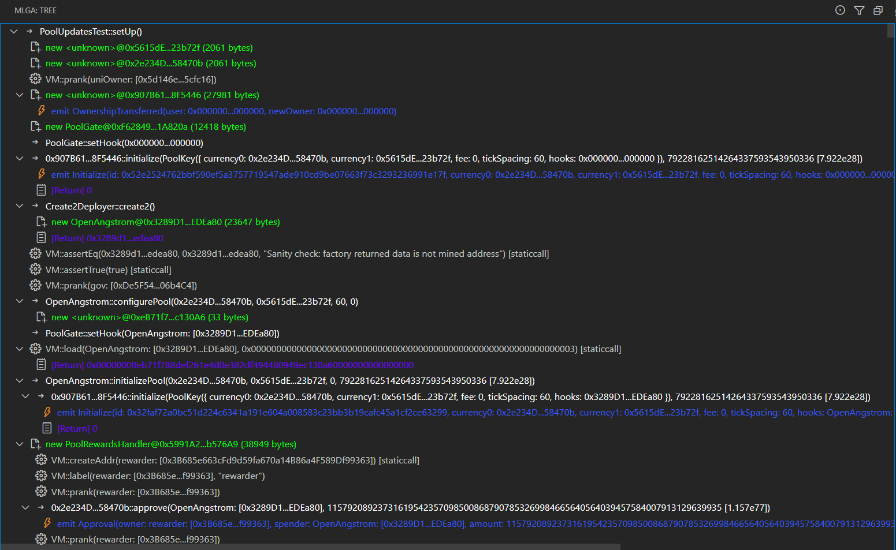
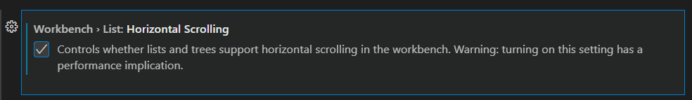

# MLGA

**Make Logs Great Again (MLGA)** is a VS Code extension that allows you to view Foundry debug logs in a more readable and comfortable format by allowing you to collapse/expand needed branches of test and search for specific logs.

Additionally, some work has been done to make the default logs appear more pleasant, such as:

- Different highlighting and icons for different types of logs
- Shortened addresses
- Making some logs more readable (combining them into one log or removing unimportant details)
- Hide setups

## Quick Intro

1. To use the extension, you should create a **mlga.txt** file in your root folder, which will contain your logs.
2. To do this, you can use a command like this: `forge test --mt TEST_NAME -vvvvvv > mlga.txt`
3. After that, you can open the extension, and the tree with logs will appear.

_If your logs are too long and you can't scroll, you should probably enable this option in VS Code_:

